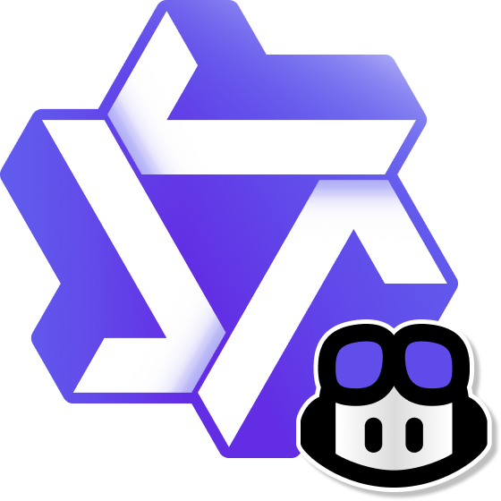

<p style='text-align: center;'>
   
   <h1 style='text-align: center;'>Qwen VSCode Chat</h1>
</p>

A VS Code extension that integrates Qwen and other Alibaba Cloud language models directly into your code editor using GitHub Copilot Chat 🔥

---

## ⚡ Quick Start
1. Clone this repository and build the extension (see [Development](#-development) section).
2. Open VS Code's chat interface.
3. Click the model picker and click "Manage Models...".
4. Select "Qwen" provider.
5. Run the command `Qwen: Manage API Key` from the command palette.
6. Provide your Alibaba Cloud API Key, you can get one in your [Model Studio console](https://bailian.console.aliyuncs.com/?tab=model#/api-key).
7. Start chatting with Qwen models! 🥳

## ✨ Features

### 🤖 AI Chat Integration
- Seamless integration with Qwen language models hosted on Alibaba Cloud
- Chat interface directly within VS Code Copilot Chat
- Support for multiple Qwen models including Qwen3, Kimi K2, and more

### 🔑 Easy API Key Management
- Simple command to manage your Alibaba Cloud API keys
- Secure storage using VS Code's secret storage
- Quick setup and configuration

### 💬 Interactive Chat
- Real-time conversation with AI models
- Context-aware responses
- Markdown formatting support

### 🛠️ Developer Tools
- Code analysis and suggestions
- Natural language to code translation
- Documentation assistance

## ✨ Why use the Qwen provider in Copilot
* Access [SoTA LLMs](https://help.aliyun.com/zh/model-studio/developer-reference/compare-models) with tool calling capabilities.
* Built for high availability and low latency.
* Transparent pricing: what Alibaba Cloud charges is what you pay.

---

## Requirements
* VS Code 1.109.0 or higher.
* Alibaba Cloud account with Model Studio API access.

## 🛠️ Development
```bash
git clone https://github.com/nguyenlean96/qwen-vscode-chat
cd qwen-vscode-chat
pnpm install
pnpm run watch
```
Press F5 to launch an Extension Development Host.

Common scripts:
* Build: `pnpm run compile`
* Watch: `pnpm run watch`
* Lint: `pnpm run lint`
* Package: `pnpm run package`

### Building the Extension

To build and package this extension for local development or distribution:

1. Package the extension:
   ```bash
   pnpm run package
   ```

2. To install the packaged extension locally for testing:
   ```bash
   code --install-extension <path-to-packaged-extension.vsix>
   ```

---

## 📚 Learn more
* Alibaba Cloud Model Studio documentation: https://www.alibabacloud.com/en/product/modelstudio
* VS Code Chat Provider API: https://code.visualstudio.com/api/extension-guides/ai/language-model-chat-provider

---

## Support & License
* Open issues: https://github.com/nguyenlean96/qwen-vscode-chat/issues
* License: MIT License Copyright (c) 2025 nguyenlean96
